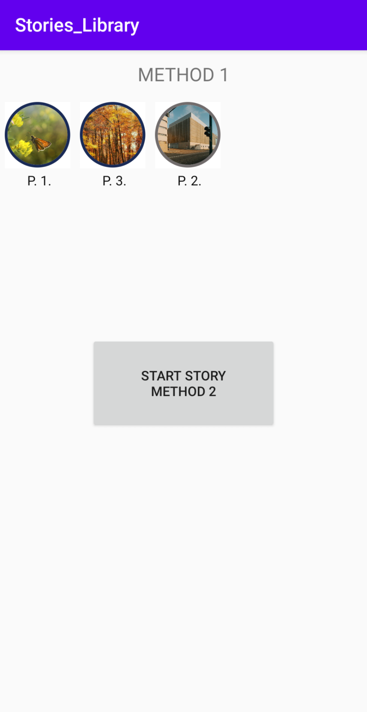

# Stories_Library
A whatsapp/instagram inspired stories library that can be added as a dependency and added to any android project.

This library will help you generate a horizontal recycler view filled with round containers, each container representing a single sender, as in instagram.
If you want more creative control, this library also gives you an option to make the container yourself.

# Install

Step 1. Add it in your root build.gradle at the end of repositories:

	allprojects {
		repositories {
			...
			maven { url 'https://jitpack.io' }
		}
	}
  
Step 2. Add the dependency

	dependencies {
	        implementation 'com.github.ridhambhat:Stories_Library:1.1.1' //Replace the version number with the latest version
	}

# How To Use

For method 1 [instagram inspired story handler recycler view], use steps 3-5.

Step 3. Make an empty frame layout in the xml file of the activity you want the story bar to appear

	<FrameLayout
		android:layout_width="match_parent"
		android:layout_height="wrap_content"
		android:id="@+id/fl"
        />

Step 4. Go into the activity java file and add the commands below.

	FragmentManager fm = getSupportFragmentManager();   // A fragment manager [it is an parameter for the story library]
	Context ctx = this; //Use the context in your activity
        final status_handler sh = new status_handler(ctx, R.id.fl, fm);   //fl is the id of the fragment created in step 3. 
	
Step 5. Now, you are ready to go. You can add stories both with time and without time. The one with time specified will dissapear after 24 hours. The one with no time will stay forever.

	//Important note:
        //If time is given it should be in the format => "dd/MM/yyyy HH:mm:ss"
        //and as a string
        //If the format is different, it will throw a Parse Exception

	//sh is the object created in step 4
        sh.addStory("Page 1", "https://cdn.pixabay.com/photo/2020/06/28/14/45/butterfly-5349558_960_720.jpg", "06/07/2020 22:02:12");
        sh.addStory("Page 2", "https://cdn.pixabay.com/photo/2020/06/29/21/13/city-5354477_960_720.jpg", "06/07/2020 22:05:12" );
        sh.addStory("Page 3", "https://cdn.pixabay.com/photo/2020/06/23/12/22/forest-5332379_960_720.jpg", "06/07/2020 22:03:12");

        //If we don't want to add a time and want the story to last forever
        //We can do that too

        sh.addStory("Page 1", "https://cdn.pixabay.com/photo/2020/06/28/21/41/cat-5350785_1280.jpg");
        sh.addStory("Page 1", "https://cdn.pixabay.com/photo/2020/06/30/22/18/cat-5357759_1280.jpg");
        sh.addStory("Page 2", "https://cdn.pixabay.com/photo/2020/03/07/05/18/coffee-4908764_960_720.jpg");
        sh.addStory("Page 3", "https://cdn.pixabay.com/photo/2020/03/04/05/57/key-4900643_960_720.jpg");
	
This should add the stories in the bar, ready to be used. 

For Method 2, follow steps 6

Step 6. We will make an intent to launch the story main class. We will also pass the appropriate parameters for it to function properly. All the details about the parameters is mentioned below.
	 
        //First we make a new intent that will start a new Activity which will display all the stories
       	 Intent it=new Intent(ctx, stories_main.class);
	 
	//To launch the story module
        //We have a few parameters

        // Parameter 1 with label "url"
        //It is an ArrayList<ArrayList<String>>
        //These contain the links of all stories categorically
        //The inner ArrayList contains link of stories from the same sender
        //And the outer arraylist is just for multiple senders
        //for example if "Person1" has 2 stories with "link1" and "link2"
        //and "Person2" has 3 stories with "link3", "link4" and "link5"
        //then the arraylist will look like
        //< <"link1", "link2"> , <"link3", "link4", "link5"> >
	
        it.putExtra("url",alllinks);

        //Parameter 2 is with label "allIndex"
        //It stores that an individual from page should start from which story number
        //If we take the above example
        //and the stories with "link1", "link3", "link4" are already viewed
        //Then if the stories are viewed the next time, they should start from "link2" and "link5" respectively
        //So, "allIndex" expects an array of the size same as the from list
        //Which contains the starting points
        //SO in above example an array like [1,2] should be passed
        //INDEXING STARTS FROM ZERO
        //THAT IS WHY AN ARRAY OF ZEROS ARE PASSES IN GIVEN SAMPLE AS STATES ARE NOT STORED
	
        it.putExtra("allIndex",sortedPosition);

        //Parameter 3 is with the label "position"
        //It stores the value which signifies which page sgould be opened first
        //If you want that the stories should open from page of "person 2"
        //Then value of "position" should be 1 //as indexing starts from 0
	
        it.putExtra("index",position);

        //Parameter 4 is with the label "from"
        //It is an arraylist that will contain all the labels of senders
        //Do note that they should be in the same order in which links are
        //i.e. if the links of "person 1" are placed first in the "url" parameter
        //then, "person 1" should be first in the "from" parameter too
	
        it.putExtra("from",from);

        //Parameter 5 is with the label "time"
        //It is an Arrayist<ArrayList<String>> which runs parallel to the "url" parameter
        //The times of the story with corresponding links are placed in this Arrayist<ArrayList<String>>
        //Do remember, you are just passing a string and it will be shown as it is
        //No calculations of time are performed on it and stories won't die even after a day has passed
	
        it.putExtra("time",time);

        //With all parameters loaded, you can start the story activity now.
	
        startActivityForResult(it,0);

# Sample Shots

<table>
  <tr>
    <td> </td>
    <td> </td>
    <td> </td>
    <td> </td>
  </tr>
 </table>

# Libraries Used

https://github.com/square/picasso
Excellent and widely popular image downloading and caching library for Android.

https://github.com/lopspower/CircularImageView
Simple and highly functional library which helps in making circular image view frames.

# License

Copyright 2020 Ridham Bhat

Licensed under the Apache License, Version 2.0 (the "License");
you may not use this file except in compliance with the License.
You may obtain a copy of the License at

    http://www.apache.org/licenses/LICENSE-2.0

Unless required by applicable law or agreed to in writing, software
distributed under the License is distributed on an "AS IS" BASIS,
WITHOUT WARRANTIES OR CONDITIONS OF ANY KIND, either express or implied.
See the License for the specific language governing permissions and
limitations under the License.

